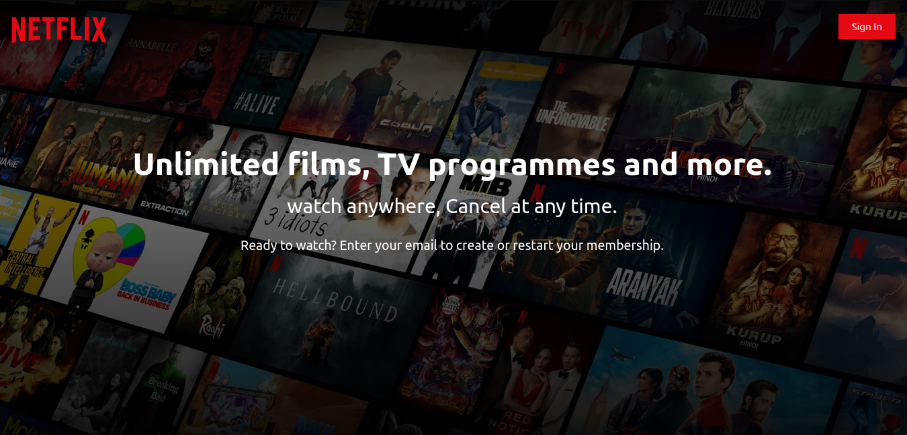
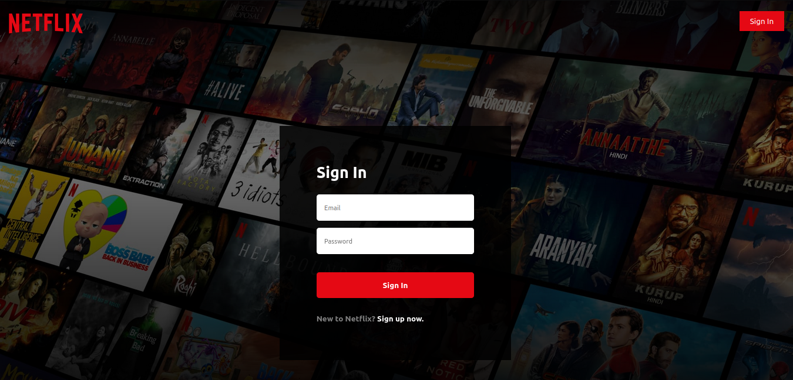
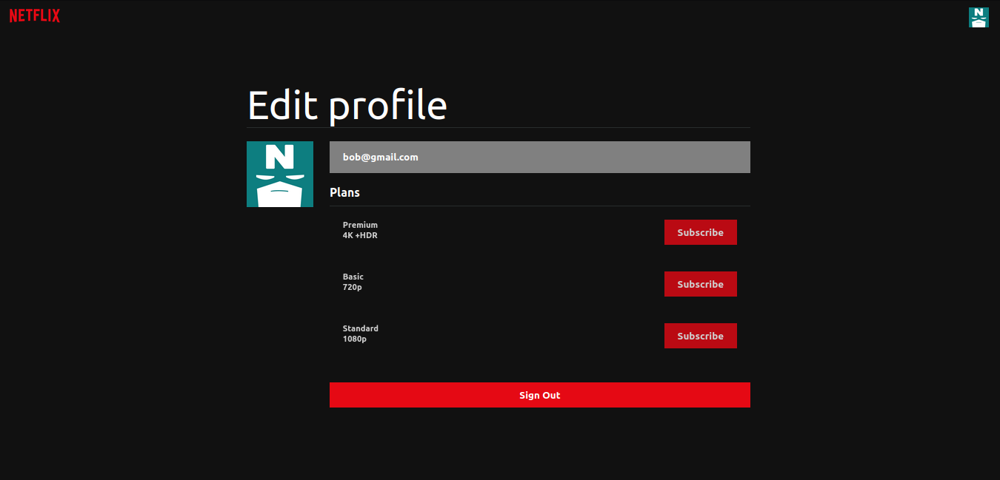

# Netflix Clone Project

This project is a Netflix clone built using JavaScript, React, HTML, and CSS. It features a login and logout authentication flow with Google, Redux for state management, and integration with The Movie Database (TMDB) to fetch film information for the Netflix app.

## Features

- User authentication with Google OAuth for login and logout functionality.
- Redux implementation for efficient state management.
- Integration with TMDB API to fetch movie information.
- Responsive design for compatibility with various devices.
- Netflix-like user interface for browsing and watching movies.

## Clone Repository
`git clone https://github.com/Emnaghz/Netflix-clone.git`

## Overview

### Welcome Screen (Not Authenticated User)

### Sign In / Sign Up Screen (with Error Handling)

### Home Screen
")

")

### Profile Screen

## Contributing
Contributions are welcome! If you find any issues or have suggestions.
